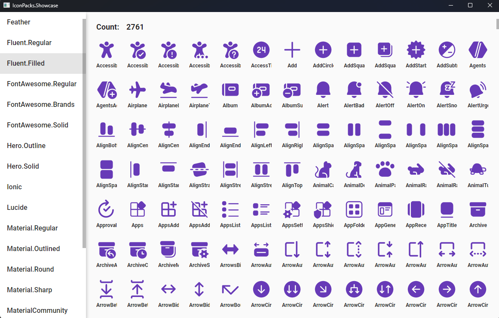

# IconPacks.NET

Awesome icon packs for .NET


| Category                                                     | Package                                                      |
| ------------------------------------------------------------ | ------------------------------------------------------------ |
| [Feather](https://github.com/feathericons/feather.git)       | [](https://www.nuget.org/packages/IconPacks.Feather) |
| [fluentui-system-icons](https://github.com/microsoft/fluentui-system-icons.git) | [](https://www.nuget.org/packages/IconPacks.Fluent) |
| [FontAwesome free](https://github.com/FortAwesome/Font-Awesome.git) | [](https://www.nuget.org/packages/IconPacks.FontAwesome) |
| [ Heroicons](https://github.com/tailwindlabs/heroicons.git)  | [](https://www.nuget.org/packages/IconPacks.Hero) |
| [Ionicons](https://github.com/ionic-team/ionicons.git)       | [](https://www.nuget.org/packages/IconPacks.Ionic) |
| [lucide-icons](https://github.com/lucide-icons/lucide.git)   | [](https://www.nuget.org/packages/IconPacks.Lucide) |
| [Material-design-icons(google)](https://github.com/google/material-design-icons.git) | [](https://www.nuget.org/packages/IconPacks.Material) |
| [MaterialDesign(community)](https://github.com/Templarian/MaterialDesign.git) | [](https://www.nuget.org/packages/IconPacks.MaterialCommunity) |
| [RemixIcon](https://github.com/Remix-Design/RemixIcon.git)   | [](https://www.nuget.org/packages/IconPacks.Remix) |
| [Tabler-icons](https://github.com/tabler/tabler-icons.git)   | [](https://www.nuget.org/packages/IconPacks.Tabler) |


## IconPacks showcase

The showcase app for all available icon packs is available [here](./src/IconPacks.Showcase).




## Usage

Using IconPacks.Feather as an example.

### WPF

1. Install Package

```shell
dotnet add package IconPacks.Feather
dotnet add package IconPacks.Generator
```

2. Add a new class to your project.

```csharp
namespace WpfApp.FeatherIcons;

[IconPacks.Generator.WpfGeometryConverter(typeof(IconPacks.Feather.Regular))]
public static partial class Regular { }
```

3. Now you can use it in XAML.

```xml
<Window
 ...
 xmlns:feather="clr-namespace:WpfApp.FeatherIcons"
 ...
>
 <Grid>
   <Path
     Width="96"
     Height="96"
     Data="{x:Static feather:Regular.Activity}"
     Fill="Red"
     Stretch="Uniform" />
 </Grid>
</Window>
```

### Avalonia

1. Install Package

```shell
dotnet add package IconPacks.Feather
dotnet add package IconPacks.Generator
```

2. Add a new class to your project.

```csharp
namespace AvaloniaApp.FeatherIcons;

[IconPacks.Generator.AvaloniaGeometryConverter(typeof(IconPacks.Feather.Regular))]
public static partial class Regular { }
```

3. Now you can use it in XAML.

```xml
<Window
 ...
 xmlns:feather="using:AvaloniaApp.FeatherIcons"
 ...
>
 <Grid>
   <Path
    Width="96"
    Height="96"
    Data="{x:Static feather:Regular.Activity}"
    Fill="Red"
    Stretch="Uniform" />
 </Grid>
</Window>
```


### MAUI

1. Install Package

```shell
dotnet add package IconPacks.Feather
```

2. Now you can use it in XAML.

```xml
<ContentPage
 ...
 xmlns:feather="clr-namespace:IconPacks.Feather;assembly=IconPacks.Feather"
 ...
>
 <Grid>
   <Path
    Width="96"
    Height="96"
    Data="{x:Static feather:Regular.Activity}"
    Fill="Red"
    Stretch="Uniform" />
 </Grid>
</ContentPage>
```


## License

Each icon library has its own license. Please refer to its project directory for details.

